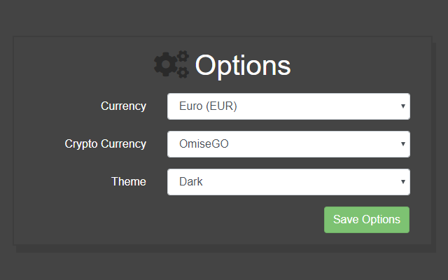
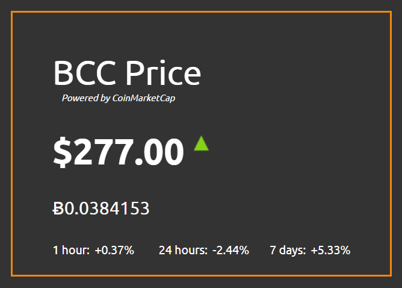

## Crypto Tracker
A chrome extension showing the current price of your desired crypto currency from CoinMarketCap on the badge. Includes a popup with more detailed information. As well as options where you can choose your desired crypto currency and its going rate.

### Chrome Web Store
[Chrome Chrome Extensions](https://chrome.google.com/webstore/detail/crypto-tracker/oclnggnhbahdbgjoldcboibocfbligpi)

### Screenshots:

### New in v0.0.9:
* Fixed some bugs
* Show double precision price on the badge and popup.
* Changes to the Options screen.
* New light theme which can be turned on from the Options screen.

### Roadmap:
- v0.1.0 - Desktop alerts when the price hits a certain threshold
